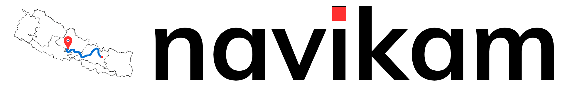

# Navikam - 433MHz Frequency Development

Welcome to the United Tech Club's Navikam project repository! This project focuses on developing a reliable and efficient GPS tracking system using LoRa technology at the 433MHz frequency. It is feasible in 868 MHZ frequency too which is unliscenced band allowed by nepal government to M2M or IOT Device Communication

---

## Overview

The **Navikam** is designed for various applications, including wildlife monitoring, disaster rescue, security, asset management, and transport logistics. Leveraging the 433MHz frequency, this device aims to overcome limitations associated with traditional cellular and satellite tracking technologies.

---

## Key Features

- **Frequency:** 433MHz ISM band
- **Low Power Consumption:** Extended battery life for prolonged field deployment
- **Long-Range Communication:** Up to 50 KM range
- **Cloud Integration:** Real-time data access and management via cloud platforms
- **Repeater Functionality:** Extends the network range and coverage
- **Robust Design:** Durable and weather-resistant for harsh environments
- **Real-time GPS Tracking:** Accurate location data transmission
- **Multi-use Cases:** Suitable for wildlife tracking, disaster rescue, security, asset, and transport management
- **Mesh Network Implementation:** Intended to work in mesh network environment for long ranges

---

## Objectives

1. **Wildlife Tracking:** Monitor and protect wildlife by tracking movement and behavior patterns in real-time without disturbing their natural habitat.
2. **Disaster Rescue:** Enhance rescue operations by providing real-time location data of assets and personnel during natural disasters.
3. **Security:** Improve security measures by tracking valuable assets and ensuring their safety.
4. **Asset Management:** Efficiently manage and monitor the location of assets to prevent loss or theft.
5. **Transport Logistics:** Streamline transport operations with real-time tracking of vehicles and goods.

---

## Advantages Over Cellular and Satellite Technologies

- **Cost-Effective:** Significantly reduces operational costs compared to cellular and satellite systems.
- **Extended Battery Life:** Low power consumption extends battery life, ideal for long-term deployments.
- **Wide Coverage:** Provides extensive coverage in rural and remote areas where cellular networks are often unreliable.
- **Scalability:** Easily scalable for large networks without the high costs associated with satellite technology.
- **Reliability:** Less susceptible to outages, providing more consistent performance.

---

# Comparison Table

| **Criteria**                   | **LoRa**                                                                  | **Satellite**                                                   | **Cellular**                                                    |
| ------------------------------ | ------------------------------------------------------------------------- | --------------------------------------------------------------- | --------------------------------------------------------------- |
| **Cost-Effectiveness**         | Low operational cost; no recurring fees; uses unlicensed frequency bands  | High equipment and subscription costs                           | Costs for SIM cards, data plans, and operation fees             |
| **Power Efficiency**           | Extremely low power; devices can run for years on batteries               | High power consumption, reducing battery life                   | Higher power usage; shortens device battery life                |
| **Range & Remote Coverage**    | Long-range (up to 15–20 km in rural areas); independent of infrastructure | Global coverage but high cost and latency                       | Limited to areas with cellular network infrastructure           |
| **Scalability**                | Supports dense IoT networks with low bandwidth requirements               | Expensive and limited scalability                               | Scalability constrained by cost and spectrum limitations        |
| **Data Throughput**            | Ideal for low data rate applications like IoT sensors                     | Excessive and costly for low-data use cases                     | Designed for high throughput, inefficient for small IoT packets |
| **Infrastructure**             | Can operate with private gateways; no dependency on external networks     | Requires satellites and external providers                      | Dependent on telecom infrastructure (towers, base stations)     |
| **Resilience to Interference** | Resistant to interference using spread spectrum technology (CSS)          | Prone to atmospheric and line-of-sight interference             | Prone to congestion and interference in urban areas             |
| **Ease of Deployment**         | Simple setup with private networks                                        | Complex and costly; specialized equipment required              | Relies on telecom networks and agreements                       |
| **Privacy & Security**         | Private networks offer full control over data                             | Data handled by third-party providers, raising privacy concerns | Data exposed to risks from telecom operators                    |

---

## Navikam Picture

<table>
  <tr>
    <td></td>
    <td></td>
    <td></td>
  </tr>
  <tr>
    <td></td>
    <td></td>
    <td></td>
  </tr>
</table>
---
